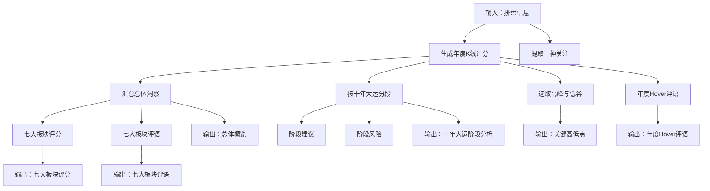
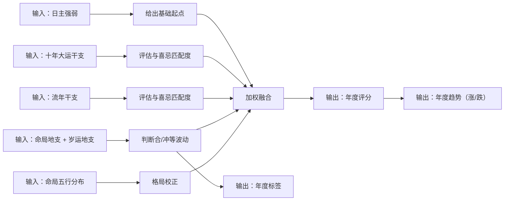
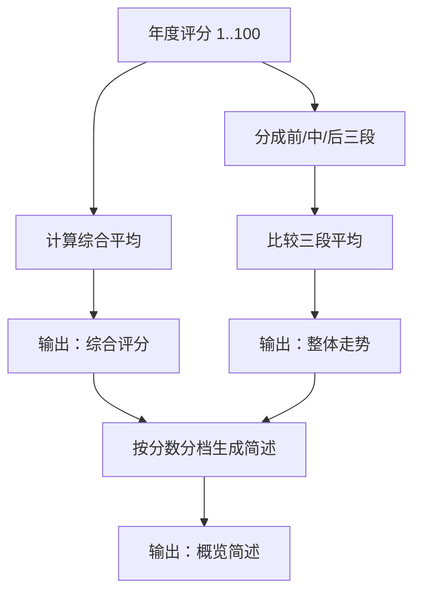
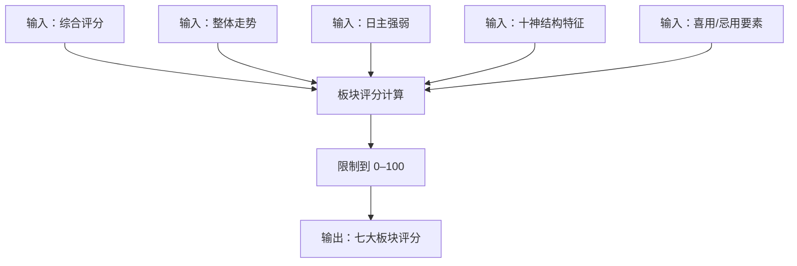
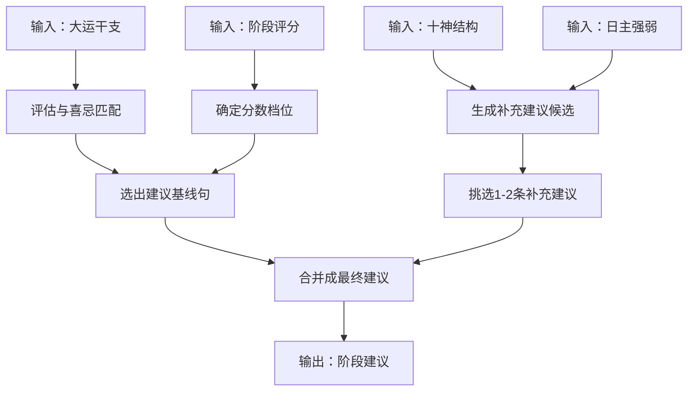
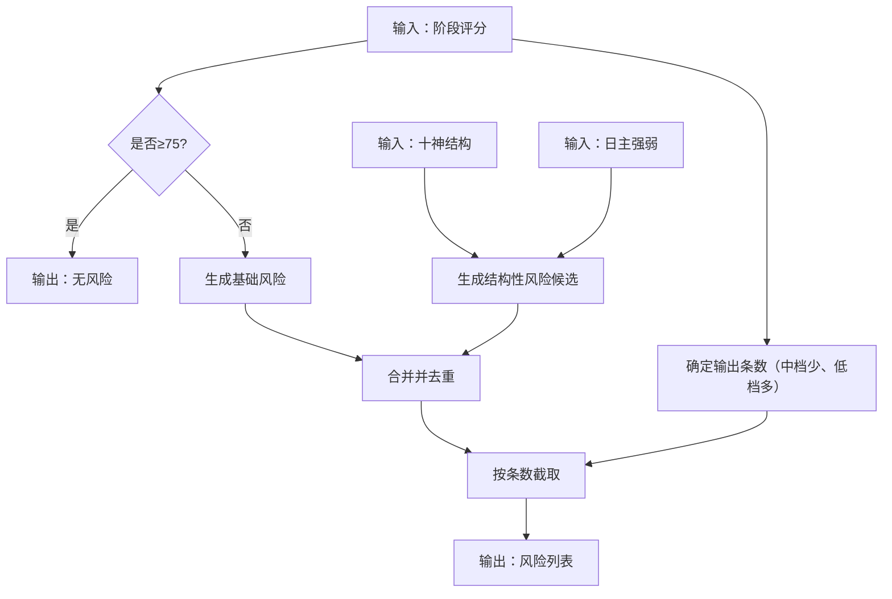
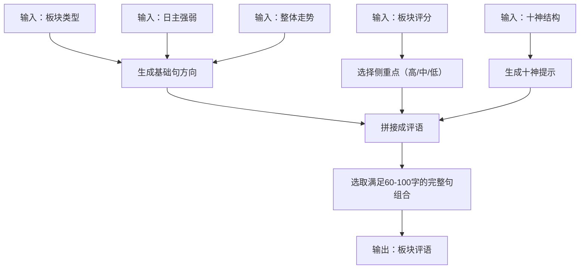
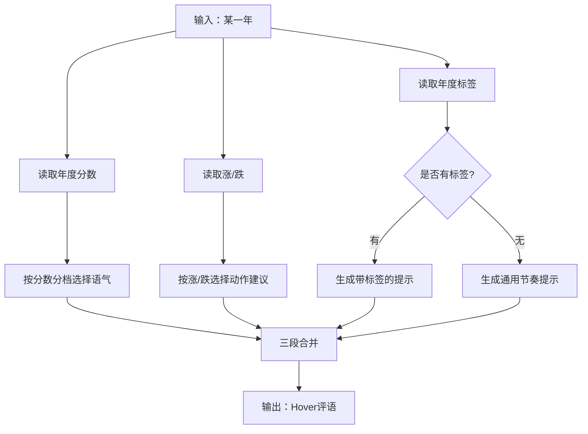

# 人生K线 评分与文案生成逻辑

本页说明 人生K线 里所有“评分 / 评语 / 建议 / 风险”的生成方式，并用流程图串起从输入到输出的全过程。

## 输入与输出

### 输入
- 排盘信息：日主强弱、喜用/忌用五行、四柱与藏干对应的十神、十年大运列表
- K 线结果：1～100 岁每一年的评分与涨跌、十年大运分段、总体洞察

### 输出（Step3 展示项）
- 总体概览：综合评分、整体走势、十神关注、简述
- 人生百年 K 线：年度评分、年度标签（如合/冲/冲日支/岁运并临）与 hover 评语
- 人生阶段分析（十年大运）：每段分数、阶段强弱、建议、风险
- 关键高低点：高峰/低谷若干条
- 七大板块：每块 0–100 评分 + 60–100 字评语

## 评分生成逻辑

### 1) 年度评分（1～100 岁每年）
年度评分不是随机值，而是把多个因素“加权融合”后得到：
- 基础：由日主强弱给出一个起点（强/中/弱对应不同基础水平）
- 大运影响：十年大运的干支五行与喜忌的匹配程度（偏利/中性/偏不利）
- 流年影响：当年的干支五行与喜忌的匹配程度（偏利/中性/偏不利）
- 冲合影响：命局地支与岁运之间的“合/冲”等关系会带来波动，并生成对应标签
- 格局偏向：命局五行分布的偏重/均衡会产生小幅校正

同时会生成：
- 年度趋势（上涨/回撤）：取决于该年的评分相对上一年的变化
- 年度标签：用于 hover 展示（合、冲、冲日支、岁运并临等）

### 2) 十年大运评分与阶段强弱
- 每一段十年大运的评分：取该段内所有年度评分的平均值（并做 0–100 的限制）
- 阶段强弱：
  - ≥ 75：偏强
  - 60–74：平稳
  - < 60：偏弱

### 3) 总体概览（综合评分、整体走势、简述）
- 综合评分：取 1～100 岁所有年度评分的平均值（并做 0–100 的限制）
- 整体走势：把人生分成“前段 / 中段 / 后段”三段，对比三段平均值，哪段最高就标为“前高/中高/后高”；如果差异不突出则为“波动”
- 简述：根据综合评分分档输出三段式概述（偏强/平稳/偏弱的口吻）

### 4) 关键高低点
- 高峰：把年度评分从高到低排序，取前若干条
- 低谷：把年度评分从低到高排序，取前若干条

### 5) 七大板块评分（性格/事业/风水/财富/情感/健康/六亲）
七大板块的评分都遵循同一个框架：
- 以“综合评分”为基准分
- 根据板块关注的因素做“加分/扣分”
- 最后把结果限制在 0–100

各板块关注点如下（只描述逻辑，不展开具体系数）：
- 性格：更看重日主强弱的倾向（强/中/弱会影响稳定性与推进风格）
- 事业：更看重整体走势与官杀、财星相关的十神结构（执行力、资源与机会窗口）
- 风水：更看重喜用/忌用元素的数量与取舍（强调“趋利避害”的配置方向）
- 财富：更看重财星相关十神 + 整体走势的顺逆（强调现金流与投入节奏）
- 情感：更看重日主强弱的均衡度 + 官星与伤官的结构特征（沟通、边界、稳定性）
- 健康：更看重日主强弱 + 整体是否偏波动（强调作息与长期稳定投入）
- 六亲：更看重比劫类结构与喜用要素（强调边界、协作与长期维护）

## 文案/建议/风险生成逻辑

### 1) 十年大运“建议”生成
建议的目标是“同一套规则、不同阶段能有不同表达”，避免大量重复：
- 先判断该段大运与喜忌的匹配程度（偏利/中性/偏不利）
- 再结合该段分数所在区间（偏强/平稳/偏弱）选出一条“建议基线句”
- 然后根据十神结构与日主强弱，追加 1～2 条“补充建议”
- 句子选择使用“可复现的选取方式”（同一阶段多次打开结果一致，但不同阶段更容易分散）
- 最终用分号把多段建议串起来

### 2) 十年大运“风险”生成
风险强调“高分少风险、低分多风险”并避免冗余：
- 若阶段分数 ≥ 75：直接不给风险
- 若阶段分数较高但未达强势：给 1 条基础风险，并补充 0～1 条结构性风险
- 若阶段分数偏低：给 1 条基础风险，并补充 1～2 条结构性风险
- 风险点做去重，并限制最终条数：中档输出更少，低档输出更多

### 3) 七大板块“评语”（60–100 字）生成
七大板块评语采用“基础句 + 侧重点 + 十神提示 + 字数控制”的结构：
- 基础句：按板块类型选择话术方向，并引入日主强弱、整体走势、喜忌要点等信息
- 侧重点：根据板块评分分档（高/中/低）选择不同的行动导向
- 十神提示：高分强调“特质转化”，低分强调“波动化解”
- 字数控制：不足则追加一句完整收尾；过长则改用更短话术组合或减少一段，保证 60–100 字且不截断断句
- 句子选择同样使用“可复现的选取方式”，让不同板块/分数更不容易撞词

### 4) K 线 hover “评语”生成
hover 评语为“三段式短评”，同样以分档与标签驱动：
- 第一段（语气）：按年度分数分成强/中/弱，选不同语气
- 第二段（动作建议）：按该年涨/跌选不同建议
- 第三段（标签提示）：若该年存在合/冲等标签则带上提示；否则给通用的节奏提示
- 句子选择使用“可复现的选取方式”，确保同一年多次查看一致、不同年份尽量不同

